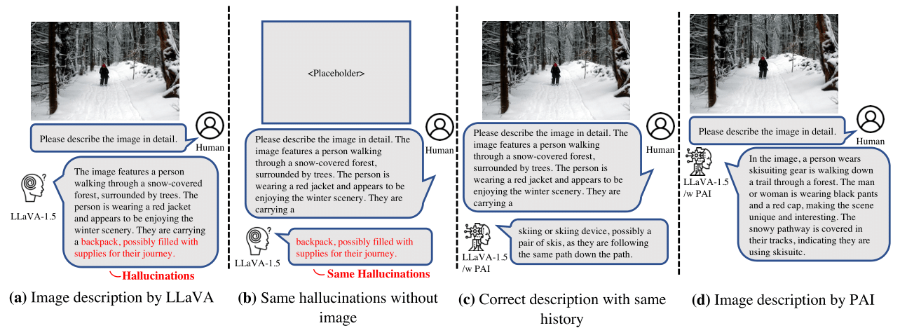

# Paying More Attention to Image: A Training-Free Method for Alleviating Hallucination in LVLMs (ECCV 2024)

[](https://opensource.org/licenses/MIT)
[](https://arxiv.org/abs/2407.21771)
[](https://github.com/huggingface/transformers)
[](https://github.com/LALBJ/PAI)


This repository provides the official PyTorch implementation of the following paper:

> [**Paying More Attention to Image: A Training-Free Method for Alleviating Hallucination in LVLMs**](https://arxiv.org/abs/2407.21771) <br> > [Shi Liu](https://lalbj.github.io/)<sup>1</sup>,
> [Kecheng Zheng](https://zkcys001.github.io/)<sup>1,2</sup>,
> [Wei Chen](http://www.cad.zju.edu.cn/home/chenwei/)<sup>2</sup>,<br> > <sup>1</sup>State Key Lab of CAD\&CG, Zhejiang University,<sup>2</sup>Ant Group <br>

## Overview

<p align="center"></p>
Existing Large Vision-Language Models (LVLMs) primarily align image features of vision encoder with Large Language Models (LLMs) to leverage their superior text generation capabilities.
However, the scale disparity between vision encoder and language model may led to LLMs assuming a predominant role in multi-modal comprehension.
This imbalance in LVLMs may result in the instances of hallucinatory. 
Concretely, LVLMs may generate consistent descriptions with or without visual input, indicating that certain outputs are influenced solely by context text.
We refer to this phenomenon as ``text inertia.''
To counteract this issue, we introduce a training-free algorithm to find an equilibrium point between image comprehension and language inference. 
Specifically, we adaptively involve adjusting and amplifying the attention weights assigned to image tokens, thereby granting greater prominence to visual elements.
Meanwhile, we subtract the logits of multi-modal inputs from ones of pure text input, which can help LVLMs be not biased towards LLMs.
By enhancing images tokens and reducing the stubborn output of LLM, we can let LVLM pay more attention to images, towards alleviating text inertia and reducing the hallucination in LVLMs.
Our extensive experiments shows that this method substantially reduces the frequency of hallucinatory outputs in various LVLMs in terms of different metrics.

## Setup

```
conda env create -f environment.yml
conda activate pai
```

## How to use PAI in LVLMs

Our method consists of two core components:

### 1. inference intervention

This component is implemented in the `attention.py` file by replacing the attention forward method in the transformers library. Additionally, you need to specify the number of layers to be perturbed, the position information of image tokens in the input sequence, and the hyperparameters that control the perturbation.

```
llama_modify(model, start_layer, end_layer, use_attn, alpha, use_cfg,
                 img_start_idx, img_end_idx)
```

### 2. logits refine

This component is implemented in the `CFG.py` file and is utilized by passing the `logits_processor` parameter within the `model.generate()` method. Additionally, you need to construct the input information without image tokens and some related hyperparameters. We recommend using it in the nucleus sample decode method.

```
  CFGLogits(gamma, neg_promt, llm_model, start_layer, end_layer)
```

## Evaluation

### POPE

- Generate the LVLM's responsed and save them:

```bash
<!-- single round evaluation -->
python pope_eval.py --model MODEL_NAME --data-path /path/to/COCO --pope-type random --use-attn --alpha 0.2 --use-cfg --gamma 1.1 --start-layer 2 --end-layer 32

<!-- multi round evaluation -->
python pope_chat_eval.py --model MODEL_NAME --data-path /path/to/COCO --pope-type random --use-attn --alpha 0.2 --use-cfg --gamma 1.1 --start-layer 2 --end-layer 32
```

- Calculate POPE using the answer file:

```bash
python pope_ans.py --ans_file /path/to/answer.json
```

### CHAIR

- Generate the LVLM's responses and save them in a jsonl file:

```bash
python chair_eval.py --model MODEL_NAME --data-path /path/to/COCO --use-attn --alpha 0.2 --use-cfg --gamma 1.1 --start-layer 2 --end-layer 32
```

- Calculate CHAIR using the generated jsonl file:

```bash
python chair.py --cap_file /path/to/jsonl
```

## Acknowledgement

This paper is motivated by [prompt-to-prompt](https://github.com/google/prompt-to-prompt). Our method implementation is based on the [Prompt Highlighter](https://github.com/dvlab-research/Prompt-Highlighter). The evaluation code is based on [OPERA](https://github.com/shikiw/OPERA). Thanks for their impressive works!

## Citation

If you find this work useful for your research, please cite [our paper](https://arxiv.org/abs/2407.21771):

```
@article{liu2024paying,
  title={Paying more attention to image: A training-free method for alleviating hallucination in lvlms},
  author={Liu, Shi and Zheng, Kecheng and Chen, Wei},
  journal={arXiv preprint arXiv:2407.21771},
  year={2024}
}
```
